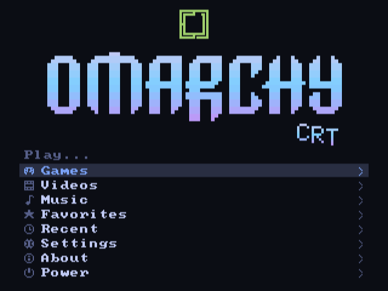
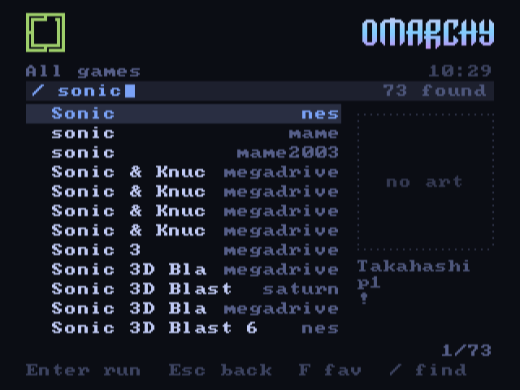
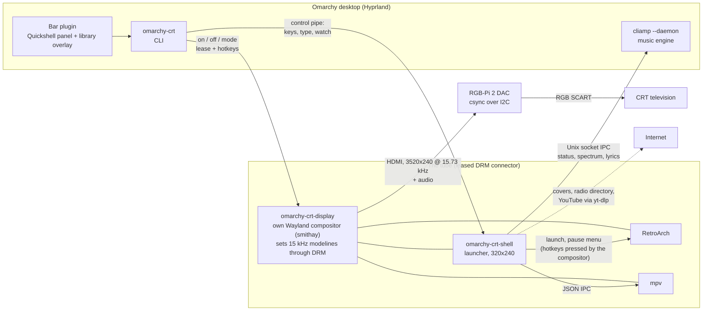

<p align="center">
  
</p>

# Omarchy CRT

An [Omarchy](https://omarchy.org) PC plugged into a 15 kHz CRT television over
RGB SCART, playing retro games the way they were drawn: native lines, native
refresh, real scanlines, no scaler in between. A launcher on the tube in the
Omarchy look, a bar plugin on the desktop, and a display process that owns the
television outright. Written in Rust, drawn at 320x240.

> **Two things to know before you read on.**
>
> **This project is written with an AI.** Design, code, tests and this very
> README are the work of a human directing Claude, commit after commit, on a
> real television in a real living room. If a codebase built that way is not
> for you, no hard feelings: there are many other repositories.
>
> **This project is for Omarchy.** It leans on Omarchy's shell, bar, theme
> files, plugins and music player on purpose. It is not a generic Linux CRT
> frontend and will not become one. If Omarchy is not your thing, this is not
> either.
>
> Omarchy CRT is a fun project by one user. It is not affiliated with, endorsed
> by or part of the official Omarchy project. Omarchy, RetroArch, RGB-Pi and
> every other name here belong to their owners.

## What it looks like

<p align="center">
  
  
  
  
  
  
</p>

Every picture above was captured from the tube's own framebuffer by
`omarchy-crt shot`; the television adds the scanlines.

## How it works



The desktop never touches the television. At boot a systemd unit installs an
EDID override that marks the DAC's connector *non-desktop*, so Hyprland leaves
it alone and offers it through the DRM lease protocol. `omarchy-crt-display`
takes the lease, programs the 15 kHz timing straight into the kernel and runs a
small Wayland compositor of its own on that output. The launcher, RetroArch and
mpv are its clients, forced fullscreen at the output's size. No bar,
notification, pointer or stray window can reach the tube, and any timing the
kernel accepts is one command away, live, including a different line count per
system (224 lines for a Super Nintendo game, 240 for a NES one).

The bar plugin and the CLI stay on the desktop and talk to the tube over a
control pipe: the panel is the remote control, the overlay manages the
collection, the CLI does everything from a terminal.

## Hardware

| Part | What worked |
| --- | --- |
| GPU | AMD Radeon RX 7700/7800 XT, stock Omarchy kernel |
| DAC | [RGB-Pi 2](docs/rgb-pi-2.md), HDMI in, SCART RGB out, composite sync selected over I2C, audio on SCART |
| Television | Bang & Olufsen BeoCenter 1, RGB SCART |
| Pads | Anything SDL knows; unknown pads get a mapping wizard on the tube |

The HDMI path works with wide "super resolution" modelines (3520x240 at 72 MHz,
15.73 kHz, 60.04 Hz for NTSC; 3840x288 for PAL). The tube turns the wide frame
back into 4:3, the emulator fills it, and every game line lands on one TV line.
A DisplayPort DAC tier (Realtek RTD2166 adapters plus a VGA to SCART sync
combiner) for native 320x240 timings is documented in
[`docs/studio-15khz.md`](docs/studio-15khz.md) (Italian) and has not been
needed so far.

## Install

```sh
git clone https://github.com/stefanomainardi/omarchy-crt.git
cd omarchy-crt
bin/omarchy-crt-install                # builds, installs to ~/.local/bin, installs both plugins
sudo bin/omarchy-crt-install --system  # once: the boot time EDID override that hands the tube over
omarchy-crt library scan ~/Games       # index your collection, any folder layout
omarchy-crt on                         # tube on: 15 kHz timing, DAC sync, audio, launcher
```

Requirements: Omarchy with Hyprland 0.56 or later (the Lua configuration),
RetroArch with libretro cores, mpv, cliamp (Omarchy's music player), yt-dlp
for YouTube, ffmpeg, curl, a stable Rust toolchain. `omarchy-crt doctor`
tells what is missing.

After `--system` the tube is handed over at every boot. Set
`shell.autostart = true` in `~/.config/omarchy-crt/crt.toml` and the
television boots straight into the launcher along with the desktop.

## The launcher

A 320x240 framebuffer drawn sixty times a second, no shader faking a tube. The
theme comes from Omarchy's own colors; every installed theme is available and
switches with a blend.

- **Boot.** Power surge and roll, a BIOS style POST with live data, the icon
  revealed band by band, a chime, the wordmark etched by a laser
  (TerminalTextEffects' `laseretch`, ported pixel by pixel), then the CRT tag
  slams in SNES title screen style over a Mode 7 floor. Both logos glint
  every few seconds afterwards.
- **Games.** Systems with console pictures, games with box art from the
  libretro thumbnails, collections, favourites, recent. `X` opens the **cover
  flow**: the selected cover large on a shelf, the neighbours receding at an
  angle, everything mirrored on the floor, sliding with inertia.
- **Search.** `/` filters the open list as you type; from the home menu it
  searches the whole collection (21,880 titles answer in a frame). Pads get
  the same with the left trigger and an on screen keyboard, and jump letter
  by letter with the shoulder buttons.
- **Launch ritual.** A cartridge slides in (a disc spins up for CD systems),
  scrape and click, the picture collapses to a line, the emulator takes over
  with the line count the system wants. RetroArch runs with its own menu and
  notifications off, save state on exit and resume on start.
- **Pause menu.** Select + Start, or the home button: resume, save state, load
  state, fast forward, reset, back to the launcher. The compositor presses
  RetroArch's real hotkeys, so nothing depends on a network command. Every
  game with a save state carries a small arrow and says when it was left.
- **Music.** On top of cliamp, started as a daemon when needed: the radio
  stations of your country, every country and genre of the Radio Browser
  directory, favourites, history, and any provider set up in cliamp (Spotify,
  YouTube Music, Qobuz, Plex, Jellyfin). The now playing screen is a **hi-fi
  deck**: a cassette whose reels turn with the music, or a radio dial whose
  needle glides to the station through a burst of static, two VU meters with
  inertia. Six idle seconds later the screen becomes a **visualizer** driven
  by cliamp's spectrum and a kick detector: Mode 7 equalizer, copper bars,
  oscilloscope, starfield, plasma, pixel fire, spectrum tower. Synced lyrics
  when cliamp has them, a sleep timer, and the selection band of every list
  breathing with the beat.
- **Videos.** Local films through mpv with a themed on screen display and a
  fit pipeline for the tube (480i or 576i by frame rate, pulldown or PAL
  speed-up for film, letterbox or crop, a safe area, a retro 240p mode).
  **YouTube** on the television: search from the tube, watch later, recently
  watched, the link in the clipboard, or `omarchy-crt watch URL` from a
  terminal; streams are fetched at 480p, all a 240 line tube can show.
- **Pads.** SDL's database plus a wizard on the tube for the pads it does not
  know: press each control once and it is mapped for good.
- **Sound.** Every click, whoosh, crackle and scrape is synthesized at
  startup. No background music of its own.

Keyboard and pad bindings are in [`docs/input.md`](docs/input.md); the
launcher's flags and offline rendering in [`shell/README.md`](shell/README.md).

## The bar plugin

<p align="center">
  
  
</p>

A television glyph in the Omarchy bar shows whether the tube is on the air
and at how many lines. The panel is the remote control: power, NTSC or PAL,
the keyboard to the launcher, DAC sync mode, audio to the TV, TV volume, a
field to send a link to the television. The **Library** overlay manages the
collection full screen: the folders the scan reads, disks that look like
collections with one click "adopt and scan", every system with its games and
core (a missing core offers its package, from the repositories or the AUR),
the BIOS files the cores expect with import from any folder that holds them,
and the folders the scan could not place with a system picker.

See [`plugin/README.md`](plugin/README.md).

## The CLI

Everything the plugin and the launcher do can be typed:

```text
omarchy-crt on | off | status | mode ntsc|pal|film [--lines N]
omarchy-crt shell start|stop|restart | shell key <input>... | shell type <text>
omarchy-crt shot out.png | record start out.mp4 | record stop | monitor on|off
omarchy-crt game menu|pause|save|load|reset|quit
omarchy-crt watch <file|url> [--later [TITLE]]
omarchy-crt library scan|discover|cores|set|assign|unknown | bios [import DIR|discover]
omarchy-crt audio crt|desktop|all|apps | audio volume N | dac csync and|xor | doctor | config set KEY VALUE
```

Details in [`docs/cli.md`](docs/cli.md). `shell key` and `shell type` drive
the launcher over its control pipe, which is how every screenshot and video in
this repository was made.

## The library scans anything

Point `omarchy-crt library scan` at a disk and it works out what every file
is: extension, the words in the folder names, disc image signatures, the
names inside zips. No renaming, no fixed folder scheme. Regional variants
collapse onto one title and systems show up when they have games. Details in
[`docs/systems.md`](docs/systems.md), the display mode per system in
[`docs/video-policy.md`](docs/video-policy.md).

## Repository layout

| Path | What |
| --- | --- |
| `shell/` | The Rust workspace: `omarchy-crt-shell` (launcher), `omarchy-crt` (CLI), `omarchy-crt-display` (lease and compositor), shared library |
| `plugin/` | The bar widget and panel; `plugin/library/` the library overlay |
| `bin/omarchy-crt-install` | Build and install everything, `--system` for the boot time lease |
| `scripts/` | The EDID override and lease setup, DRM probing, the offline demo renderer, the video takes and montage |
| `systemd/` | The oneshot unit that hands the tube over at boot |
| `docs/` | The 15 kHz study, hardware notes, systems and video policy, controllers, CLI, troubleshooting, state of the project |

## State and what is next

[`docs/plan.md`](docs/plan.md) keeps the current state. In short: the tube is
ours, games, music and video run on it, the collection is managed from the
bar. Next: interlaced 480i and 576i modelines for video, smarter cover
matching for collections whose file names carry no region tags, rewind and
aspect in the pause menu, album art on the music screens.

## Contributing

Work lands on `develop` and is merged to `main` when it runs on the
television. Commits follow Conventional Commits. `cargo build --release` in
`shell/` builds everything; `cargo test` runs the unit tests. Read the two
notes at the top before opening an issue about either.

## Credits and licenses

- Omarchy icon and wordmark: Omacom Foundation, MIT. Used here as the theme
  of a fan project; Omarchy CRT is not part of Omarchy.
- `font8x8` bitmap font: Daniel Hepper, public domain, after the IBM VGA fonts.
- `laseretch` and the effect catalog: inspired by
  [TerminalTextEffects](https://github.com/ChrisBuilds/terminaltexteffects) by
  ChrisBuilds.
- Box art: the [libretro thumbnails](https://github.com/libretro-thumbnails)
  repositories. Console pictures: RetroArch's `systematic` assets (CC BY).
- Radio directory: [Radio Browser](https://www.radio-browser.info/). Music
  engine: [cliamp](https://github.com/bjarneo/cliamp) by bjarneo.
- 15 kHz kernel patches: Calamity and D0023R. Switchres and GroovyMAME:
  Antonio Giner and the GroovyArcade community.
- Hardware research: the Batocera CRT Script wiki by ZFEbHVUE and the
  RetroRGB, shmups and arcadecontrols communities.
- Launcher flow (systems, then games, RetroArch without its menu): inspired
  by the GPL frontend of RGB-Pi OS by rtomasa; the display mode policy is our
  own on top of upstream RetroArch CRT SwitchRes.

License: MIT.
