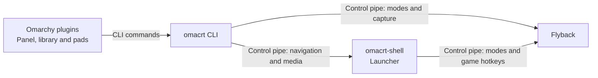
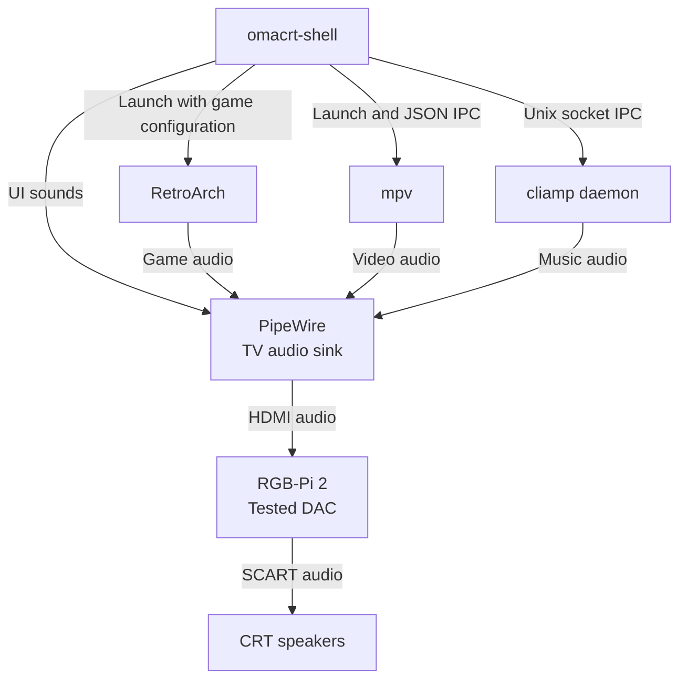

# Architecture

The [README](../README.md#how-it-works) shows the video path. Flyback leases
one connector from Hyprland and runs a separate Wayland server for the CRT.
The launcher, RetroArch and mpv connect to that server. Hyprland continues to
manage the desktop monitors.

## Desktop controls

Arrows show commands sent between processes. The Omarchy plugins are optional;
the CLI also works on plain Hyprland. The CLI starts and stops the launcher
and display process as part of `on` and `off`.

## Media and audio

Arrows are labelled with control or audio flow. cliamp provides music playback,
status, spectrum and lyrics over its socket; it is not a Wayland client of
Flyback. Flyback handles video and input, while PipeWire routes audio to the
television. The hardware path shown here is the tested RGB-Pi 2 setup.

## Display setup

At boot, the systemd lease setup unit installs an EDID override that marks the
connector as non-desktop. Hyprland then offers it through `wp_drm_lease_v1`.
Flyback takes the lease and validates modelines before applying them through DRM.

The launcher draws at 320 pixels wide and the configured line count, commonly
240 or 288. The scanout width and refresh depend on the configured mode and
hardware; the architecture does not require a fixed 3520x240 mode. The CLI
configures the RGB-Pi 2 sync mode over I2C.

See [video timings](15khz.md), [Flyback's design](flyback.md) and the
[command reference](flyback-manual.md). Network services and download handling
are described in [SECURITY.md](../SECURITY.md).
