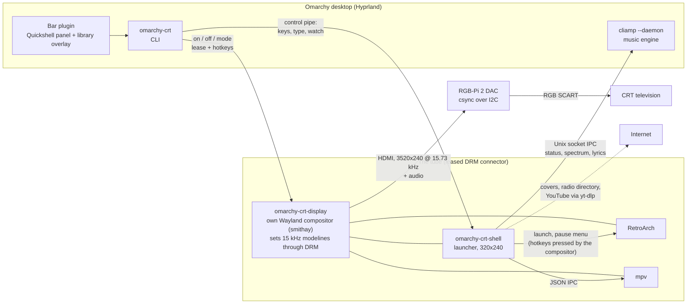

# The architecture, as a flowchart

The drawn version is in the README. This is the same thing with every process
and every channel between them named, for the parts a picture cannot hold.

Read it against [`15khz.md`](15khz.md), which says why the tube has a
compositor of its own rather than being one more output of the desktop.
