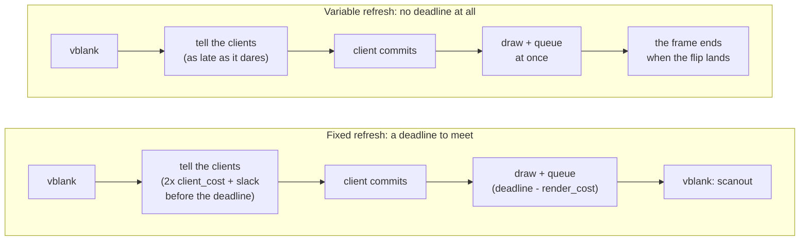
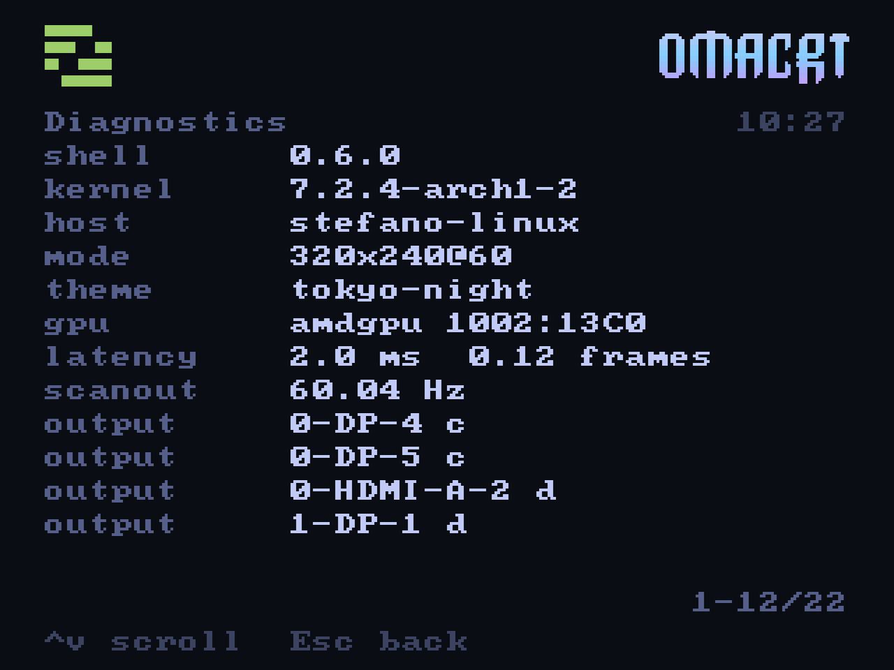

<p align="center">
  
</p>

# Flyback

A Wayland compositor that owns the scanout of a fifteen kilohertz television.

It is not a desktop, and no kiosk shell either. A kiosk compositor
puts one window on a monitor the system already knows how to drive. This one
takes a connector the desktop has been told to leave alone, programs a timing
no desktop would ever set, and then schedules every frame against what a
cathode ray tube does with it. Everything below was measured on one
television; nothing here is quoted from a specification.

**This is experimental.** It sets the line rate of a circuit tuned for one,
and the guard that keeps any other one off the connector is described under
[Safety](#safety) so that it can be checked instead of trusted. Read that
section before pointing it at a set you care about.

Where a claim here rests on hardware behaviour instead of on code, the
measurement and the method are in [`15khz.md`](15khz.md), the
reference for the display chain itself. This document is about the
compositor.

---

## What it does

### It takes the connector instead of asking for a window

The television's connector is marked non-desktop in an injected EDID
(`scripts/crt-lease-setup.sh`), so Hyprland stops configuring it and offers it
through `wp_drm_lease_v1`. Flyback takes that lease and gets a DRM file
descriptor that is master for one connector and its CRTC. From there it sets
the mode itself, with no compositor above it deciding anything: no layers, no
window rules, no scaling, no pointer.

That is the whole reason the project has a compositor instead of a
fullscreen window. A desktop compositor will not set a 15 kHz modeline,
cannot be told to stop touching an output's timing, and will not give a
client the scanout. Leasing is the supported way to ask for all three at
once, and it makes everything after this possible.

### It programs a 15 kHz modeline, and refuses everything else

The timing comes from `crt.toml`. Before any of it reaches the kernel it goes
through `Modeline::fault`, which refuses a line rate outside
`output.hfreq_khz` (15 to 16.5 kHz by default), sync outside blanking,
blanking inside the picture, and a field rate no such set will lock to. There
are exactly two ways a timing can arrive, the configuration file at start-up
and the `mode` command on the control pipe, and both call it.

### It schedules frames for a tube, not for a desktop

This is where the latency went. A compositor answers three questions once a
frame: when to tell the clients they may draw, when to draw itself, and when
to put the result in the air. The usual answers are all at the vblank, which
is safe and costs most of a frame.

At a **fixed** refresh a flip has to be queued before the vblank or the
picture waits a whole frame, so there is a deadline. Flyback draws at the
last safe moment, one frame less a margin taken from what recent frames
actually cost, and tells the clients early enough that their commit arrives
before that, twice their own measured drawing time plus a slack.

At a **variable** refresh there is no deadline at all: a flip that arrives
after the frame's minimum length simply makes that frame longer. So nothing
is held back. The compositor draws the moment a client commits, and tells the
clients as late as it dares.

The one thing it must never do with a variable rate is draw at the vblank.
Anything committed while the last flip was in flight is about to be
superseded by the frame the client is drawing now, and flipping it puts a
stale picture in the air that the fresh one then waits behind. That single
mistake cost a frame and a half, and finding it is most of why the numbers
below are what they are.



Three estimates feed it, all measured, because between
telling a client to draw and seeing its picture scanned out sit a wake-up, a
draw, a flip and a hardware latch that no constant gets right:

| | |
| --- | --- |
| `render_cost` | what this compositor takes to draw and queue, as a decaying maximum, so a heavy scene moves its own deadline earlier |
| `client_cost` | what a client takes between being told and committing, the same way |
| `rate_trim` | when a rate has been asked for by name, the measured error between the rate asked for and the rate delivered, a quarter of it corrected each frame |

The knobs are environment variables on the display process and are documented
in [`cli.md`](cli.md#latency): `FLYBACK_MARGIN_US`, `FLYBACK_LATE_DRAW`,
`FLYBACK_SLACK_US`. Each of them turns one of the decisions above back off, which is how the numbers below were separated from each other.

### It tells a client when its picture was actually shown

Flyback implements `wp_presentation` on `CLOCK_MONOTONIC`, feeding it the
timestamp the kernel puts on the page flip event, and claims
`HwClock | HwCompletion` only when the driver's stamp really is on the
monotonic clock. Without this a client cannot know when its frame reached the
screen and has to guess; mpv has used it for years and RetroArch has just
added it.

### It asks the television to change its refresh without a mode change

A set's horizontal rate must not move. Its vertical rate can: the vertical
oscillator re-triggers on sync, so every refresh an emulation asks for is
reachable by stretching the vertical blanking alone. That is exactly what
adaptive sync does in hardware, and on this chain it works: `vmin 261
vmax 327` on the tube's timing generator, at an unchanged 15.731 kHz.

Flyback turns it on by itself when the kernel says the connector is capable,
because there is nothing else a television leased to this compositor would
want it for. `rate 59.92` on the control pipe then asks for a refresh by
name, and the closed loop holds it. asked for by name and measured as the median of the last 300 vblank
intervals, with fifteen seconds of settling at each step: **60.041 asked
gives 60.04, 59.92 gives 60.02, 57.5 gives 57.59, 55 gives 55.01**, and 50
is held at 55 because that is where this set stops following. The instrument
is a median over a five second window, and the numbers are reported to the
precision it has.

Where a set stops following is a calibration of the room, not a constant:
`output.vrr_min_hz`, 55 Hz on the BeoCenter 1, below which the picture starts
losing height. Nothing asks the tube for less than that however slowly a
program runs. The measurements behind that number, height and brightness
through seven steps of vertical total, are in
[`15khz.md`](15khz.md#a-variable-refresh-rate).

### It reports its own latency

Every frame, the compositor knows two timestamps nobody else has: the
client's commit and the kernel's vblank. It keeps the median of the last
three hundred and writes it where the launcher and `omacrt status` can read
it, so the tube says out loud how long its own picture takes to arrive.

<p align="center">
  
</p>

That screen is photographed from the compositor's own framebuffer, which is
3520x240: the horizontal is averaged down and the vertical left alone, so the
scan lines in the picture are the scan lines the television draws.

---

## What it does not do

Stated plainly, because a compositor that lists only what it has is a
brochure.

- **No XWayland.** Nothing on the tube needs it.
- **No pointer and no touch.** The seat has a keyboard and nothing else.
  Flyback opens no input devices at all: the pad is read by the programs
  themselves through evdev, and the launcher presses keys by writing `key` on
  the control pipe. A compositor that does not open libinput is not a
  compositor anybody's desktop wants, and it is one less thing between a
  button and a picture.
- **No layer shell, no decorations, no window rules.** Every toplevel is
  fullscreen at the output's size, and the stacking order is the whole window
  management. `xdg_popup` is configured so a client that makes one is not
  broken, but popups are not mapped or drawn.
- **No clipboard, no primary selection, no drag and drop.**
- **No multi-output.** One leased connector, one CRTC, one mode. Two
  televisions would need most of this rewritten.
- **No fractional scale, no HDR, no colour management, no explicit sync
  (`linux-drm-syncobj`), no tearing control.** Tearing in particular is the
  other road to low latency and is not taken: on a 15 kHz set a torn frame is
  visible across a third of the picture, and the scheduling above gets most
  of the same time back without it.
- **No interlace.** The driver refuses it on this connector; what stands in
  the way is five gates in the kernel's display code, written up in
  [`15khz.md`](15khz.md#what-a-stock-kernel-still-cannot-do).
- **No beam racing.** The lease makes it possible for the first time on
  Linux, and it is not implemented. See
  [Prior art](#prior-art-and-what-was-already-there).
- **It is not a general-purpose compositor** and should not be used as one.

---

## The assumptions it starts from

If any of these is false, most of the above stops being true.

1. **The display chain is analogue and has no buffer.** No panel, no scaler, no frame store, so the photon leaves when the signal arrives. That is what
   makes a commit-to-vblank number nearly a press-to-photon number, and it is
   why the same scheduling on an LCD would be measuring something else.
2. **The horizontal rate is fixed and must stay fixed.** Every trick here
   moves the vertical timing only.
3. **One output, one CRTC, one program that matters at a time.**
4. **The clients are cooperative and local.** They are the launcher,
   RetroArch and mpv, started by this project, running as the same user.
5. **The GPU is an AMD one with atomic modesetting and a driver that will
   take a 15 kHz mode over a lease.** Measured on Navi 32 (RX 7700/7800 XT).
   The variable refresh rate additionally needs a FreeSync range in the
   injected EDID. It does **not** need `amdgpu.freesync_video=1`, whatever
   this document said before: that parameter gates a different mechanism, and
   reading the driver plus testing that mechanism directly says it does
   nothing here. See [`audit-2026-09-12.md`](audit-2026-09-12.md).
6. **The desktop compositor offers `wp_drm_lease_v1`.** Hyprland does.

---

## The shape of the program

One process, one thread, one `calloop` event loop. About 3400 lines across
four files, on smithay 0.7.

| | |
| --- | --- |
| `shell/src/bin/flyback/main.rs` | entry point, the probe mode, DRM property dumps |
| `shell/src/bin/flyback/lease.rs` | the `wp_drm_lease_v1` client: ask the desktop what it offers, take the connector |
| `shell/src/bin/flyback/comp.rs` | the compositor: globals, the frame scheduler, the DRM output, the control pipe, recording |
| `shell/src/bin/flyback/host.rs` | the optional preview window on the desktop, so the tube can be watched without looking at it |
| `shell/src/crt/output.rs` | `Modeline`, its parser, and `Modeline::fault` |

The globals it advertises: `wl_compositor`, `wl_subcompositor`, `xdg_shell`,
`wl_shm`, `wl_seat` (keyboard only), `wl_output` with `xdg_output`,
`zwp_linux_dmabuf_v1` with default feedback, `wp_viewporter`,
`wp_presentation`.

Four sources drive the loop: the Wayland socket, the DRM device (vblank and
flip events), the control pipe, and the timers the scheduler arms for itself.

The scheduling decisions are pure functions with tests, so they can be
argued with without a television in the room: `margin_for`, `callback_wait`,
`frame_room` and `trim_step` in `comp.rs`.

---

## The numbers

All measured on a BeoCenter 1 through an RGB-Pi 2, at 3520x240 @ 60.04 Hz,
over a leased HDMI connector on Navi 32, and all re-taken on 2026-09-12 when
every published claim in this project was checked again. Four did not
survive; what changed and why is in
[`audit-2026-09-12.md`](audit-2026-09-12.md).

**Commit to the start of scanout**, for a client that draws on the frame
callback the way a program paces itself:

| the client takes | fixed rate | variable rate |
| --- | --- | --- |
| 1 ms | 6.98 ms | **3.79 ms** |
| 2 ms | 7.90 ms | **4.61 ms** |
| 4 ms | 9.79 ms | **6.54 ms** |

Measured with the launcher mapped underneath, and that is how the television
actually runs, since a program is never the only client on it.

The launcher end to end reports **2.0 ms** in `omacrt status`, and 4.5 ms
with every core on the machine busy.

**The starting point is reproducible instead of remembered.** Turn the three
switches off - `FLYBACK_LATE_DRAW=off`, `FLYBACK_MARGIN_US=off`, and the
variable rate off, which together are this compositor with its scheduling removed - and
the same client measures **33.36 ms, two frames exactly**, with the launcher's
own figure at 33.1 ms. The comparison is there, and anybody with this hardware
can run it.

**That second sentence cost a day.** The same measurement with the launcher
stopped read 3.56 ms, and with it running read 18.70 ms, with one frame in
six arriving two frames late. The drawing-time estimate the callbacks were
paced by was one number for the whole compositor, so it was really the
slowest client on the tube; frame callbacks all go out together, and the
launcher was setting the pace for a client it was hidden behind. It is kept
per window now and read from the window on top, a window underneath no
longer decides when the flip goes out, and a window's first measurement
replaces the whole-frame assumption instead of losing to it for fifty
frames. A hidden window costs the visible one nothing: 3.79 ms against 3.56
alone.

**The whole chain**, from the kernel's timestamp for a button press to the
start of scanout, over three hundred presses at random points of the frame:
**best 1.46 ms, median 10.19 ms (0.61 frames), 95th 17.52 ms, worst
18.21 ms**, every sample kept in
[`data/press-to-picture.txt`](data/press-to-picture.txt). Of that median,
**8.33 ms is half a frame** - what any commit at a random phase waits for the
next vblank, whoever is compositing - so the compositor's own contribution is
the 1.9 ms above it. The instrument measures its own overhead at 0.01 ms.
This is a virtual pad; a real one adds its own polling in front, one to eight
milliseconds by its rate, which belongs to the pad.

**A mode change**, for comparison, takes **182 to 229 ms** to its first
vblank and the television is dark for it, whether it moves the whole standard
or only the vertical total. Re-applying a timing that has not changed costs
4 to 16 ms, which says the cost is the modeset itself. That is what
the variable refresh rate avoids.

### Reproducing them

The instrument is in the workspace and is not part of the product:

```
cargo build --release --features latency --bin latency
./shell/target/release/latency 300              # random phase
./shell/target/release/latency 300 --paced      # on the frame callback
echo "cd <repo> && ./shell/target/release/latency 300 --pad --paced" | newgrp input
```

`--pad` makes a virtual pad with `uinput`, reads the press back through evdev
with `EVIOCSCLOCKID` set to `CLOCK_MONOTONIC`, and so puts both ends of the
measurement on the same clock the vblank uses. It needs the `input` group;
`newgrp` is enough, no re-login. `--pattern` draws a self-driving test card
on the tube for filming, with a clapper and tick-counted steps.

---

## Safety

A television is not a monitor that shrugs at a signal it cannot use. Its
horizontal deflection is a tuned circuit, a flyback transformer and an output
transistor sized for one line rate, under no obligation to work at
another.

What a given set does when it is given another is a property of that set.
Some lose sync and roll, some blank, some shut themselves down, and some have
no protection worth the name. This project has not tested which, on any set,
and does not intend to: the guard below exists so that nobody finds out.

So no timing reaches the kernel without passing `Modeline::fault`, at both
places one can arrive. It refuses:

- a clock, or any timing, that is not finite and positive;
- horizontal or vertical values out of order (sync outside blanking, blanking
  inside the picture);
- a line rate outside `output.hfreq_khz`, 15 to 16.5 kHz by default;
- a field rate outside 40 to 90 Hz.

Widening the band is deliberate, documented, and in one place, for a display
that can take it: a multisync monitor or an arcade chassis rated for 25 or
31 kHz.

Five tests cover it, including that the five shipped modelines pass and that
a 31.5 kHz VGA timing is refused unless the band is widened.

The variable refresh rate is on the other axis and cannot do this: it
stretches the vertical blanking and never moves the line rate by a single
hertz. The worst it has produced is a picture that loses height, so
`output.vrr_min_hz` exists.

---

## What a program on this machine can do to the tube

The trust boundary is the user account, the same as any Wayland session. What
follows is what was checked, and what it means.

- **The control pipe** is a named FIFO created 0600 in the user's own state
  folder, opened read-write so it never reports end of file between writers.
  Any program running as the user can write a line into it, so the danger is
  a mistake instead of a stranger, exactly the kind of danger that
  reaches hardware. `mode` therefore goes through `Modeline::fault`, `key`
  refuses a code above `KEY_MAX` instead of overflowing, `rate` clamps to
  the range the set was calibrated for, and an unknown command is refused
  instead of guessed at. The read buffer is bounded: a line longer than it
  arrives in two pieces and neither parses, the right failure.
- **`shot` and `record`** take a path from that pipe and truncate it. Both
  refuse a name that is not a picture or a film respectively, which also
  keeps a leading dash from ever reaching ffmpeg as an option. ffmpeg is
  spawned with an argument vector and no shell, and the output path is behind
  a `--` guard.
- **The Wayland socket** is in `XDG_RUNTIME_DIR`, mode 0700. Any program
  the user runs can connect and will be mapped fullscreen on the television,
  exactly as on any other compositor.
- **Client buffers** are imported through smithay; a dmabuf that fails to
  import is refused through the protocol's own notifier.
- **The leased file descriptor** is master for one connector and its CRTC and
  nothing else. It cannot touch the desktop's outputs.
- **A panic in the compositor takes the television with it**, so the paths a
  client can reach avoid `unwrap` on anything a client controls. The few that
  remain are on smithay's own mutexes, which are poisoned only if another
  thread has already panicked.
- **Arithmetic overflow panics in release builds too** (`overflow-checks` is
  on in the release profile), on purpose: a television that stops
  has to stop where the mistake is, instead of wrap in silence and draw
  something wrong. It also means an overflow on a value taken from the
  control pipe is a crash, so every number
  read from it is bounded before it is used.
- **The watchdog**: ten refused page flips in a row, or two seconds without a
  vblank for a queued frame, and the display process gives up instead of
  leaving a set staring at nothing.

---

## Prior art, and what was already there

Almost none of the pieces here are new on their own. What is new is the
combination, and being exact about which is which.

- **Driving a 15 kHz display from a PC** is a solved and well-documented
  craft: GroovyMAME, CRT Emudriver, Switchres, the `advancedscan` lineage,
  and on Linux the `video=` modeline route many people have used for years.
  Super resolutions (2560x240, 3840x240) have been standard practice in that
  community for over a decade.
- **True beam racing**, drawing the frame just ahead of the beam, exists,
  in GroovyMAME and WinUAE, on Windows. It has never worked on Linux;
  RetroArch has had a bounty standing for it since 2018. The reason is that
  it needs ownership of the scanout, which a desktop compositor denies. A
  leased connector removes that obstacle, which makes this the first Linux
  setup where it could be built. It has not been built.
- **`wp_drm_lease_v1`** was designed for VR headsets, and every other user of
  it is one. Leasing a television to get a fifteen kilohertz mode is, as far
  as could be found, not otherwise done.
- **Adaptive sync on a CRT** has one prior report, on multisync PC monitors
  and not on televisions, and it observes that some sets change vertical
  size with the blanking interval. Using it deliberately, on a consumer
  television, to serve an emulator's exact refresh without a mode change is
  what this adds, together with the measurement of where a particular set
  stops following, the part that makes it usable instead of a
  demonstration.
- **Frame scheduling of this kind** is not new either. Weston, KWin,
  Mutter and Gamescope all have latency-aware schedulers, and the idea of
  drawing late is standard. What is specific here is the
  variable-refresh regime with no deadline, and a target that shows the
  result as brightness as well as motion.
- **smithay** is the framework all of this stands on, and the compositor is
  small because smithay is not.

The honest summary: this is a new combination of known parts, measured on
hardware nobody had measured this chain on, and the one thing it might be
first at, beam racing on Linux, is deliberately still on the shelf.

---

## Status

Experimental, and part of one project rather than a product. It runs one
television in one room. The interfaces described here, which are the control pipe, the environment
variables and `crt.toml`, change when a measurement says they
should.
