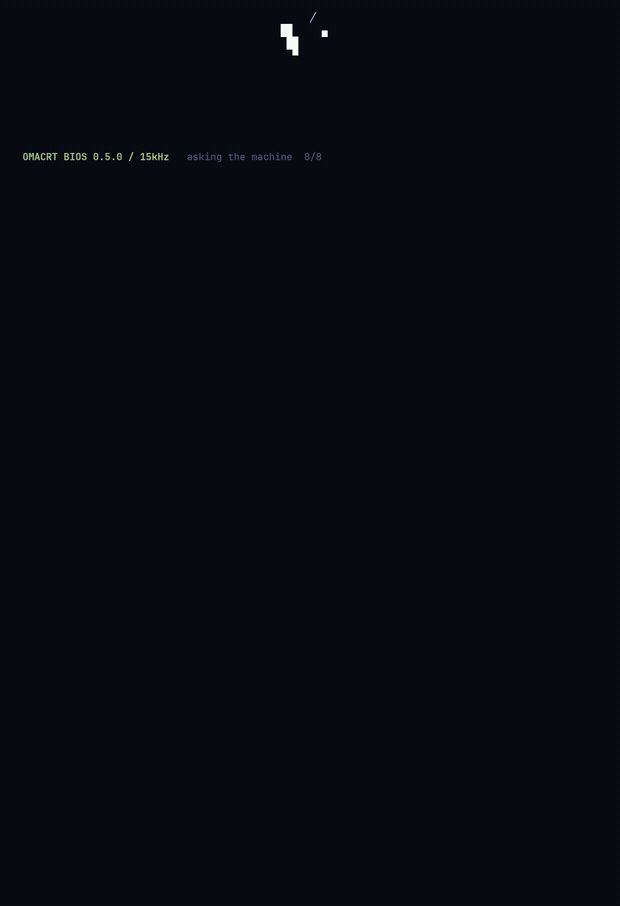
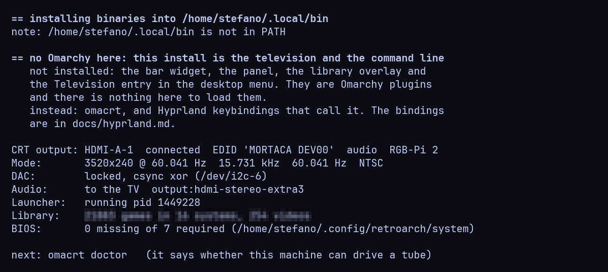

# Without Omarchy

OmaCRT is built on Omarchy and runs on plain Hyprland. This page is the second
of those, what it has and what it does not.

**The television is identical.** The launcher, the timings, the leased
connector, the games, the films, the music, the photo frame, the pads: none of
it knows what Omarchy is. Nothing in the Rust ever calls it. What changes is
the desktop, and only the desktop.

## What is not there

Four things, and all four are Omarchy plugins written against Omarchy's own
shell modules:

- The bar widget, the television glyph that turns the tube on and off.
- The panel behind it: standard, sync, TV volume, audio routing, watch a link.
- The library overlay: sources, systems, cores, BIOS.
- The Television entry in the desktop menu.

The installer does not write them, does not create the directories they would
live in, and says so when it runs.

## What replaces them

The command line, which has every verb the panel has, and Hyprland
keybindings that call it. In `~/.config/hypr/bindings.lua`, or wherever your
own bindings live:

```lua
hl.bind({ mods = "SUPER", key = "T", dispatcher = "exec", arg = "omacrt on" })
hl.bind({ mods = "SUPER SHIFT", key = "T", dispatcher = "exec",
          arg = "omacrt off" })
hl.bind({ mods = "SUPER", key = "F", dispatcher = "exec",
          arg = "omacrt focus" })
hl.bind({ mods = "SUPER", key = "N", dispatcher = "exec",
          arg = "omacrt ntsc" })
hl.bind({ mods = "SUPER", key = "P", dispatcher = "exec", arg = "omacrt pal" })
hl.bind({ mods = "SUPER", key = "L", dispatcher = "exec",
          arg = "omacrt library" })
```

`omacrt focus` is the one worth binding first: it opens the preview window on
the desktop and gives it the keyboard, which is how anything on the tube gets
typed at. Closing that window gives the keyboard back.

`omacrt --help` lists the rest. Everything the bar widget does is a verb.

## The theme

The launcher reads the desktop's current colours from
`~/.config/omarchy/current/colors.toml` when there is one, and offers every
theme installed under `~/.local/share/omarchy/themes`. Without those it uses
one of four palettes compiled into the launcher: Tokyo Night, a green
phosphor monitor, an amber one, and a television. They are on the Style screen
like any other, and `--theme PATH` points the launcher at any `colors.toml`
you like.

## What to check first

<p align="center">
  
</p>

`omacrt doctor`. The first four rows are the ones that decide whether the
machine can do this at all: the driver the card is on, whether the compositor
offers DRM leasing and for which connector, whether systemd is here for the
boot time override, and whether debugfs is mounted. They can be answered
before a DAC is bought.

The row after them says which channel you are on, and everything below it is
the same on both.

The laser is not a loading bar with a costume on. It advances because a check
answered, and when a probe is slow it waits with you. The diagram under the
report is the modeline that is actually configured, read out of `crt.toml`:
active, front porch, sync, back porch, for both axes.

This is what the install looks like on a machine with no Omarchy:

<p align="center">
  
</p>

## What is not promised

Hyprland, and no other compositor. DRM leasing is not a Hyprland invention:
wlroots, KWin and Mutter all implement `wp_drm_lease_v1`, and on the leased
path this project asks Hyprland for almost nothing else. `omacrt focus` is the
exception, and clicking the preview window does the same thing by hand. None
of that has been tried, so none of it is claimed. If you get it working on
something else, that is a thing worth an issue.
