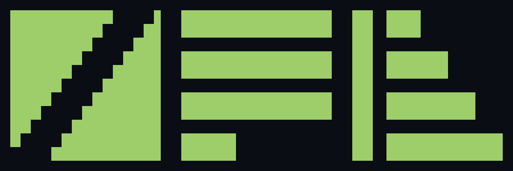
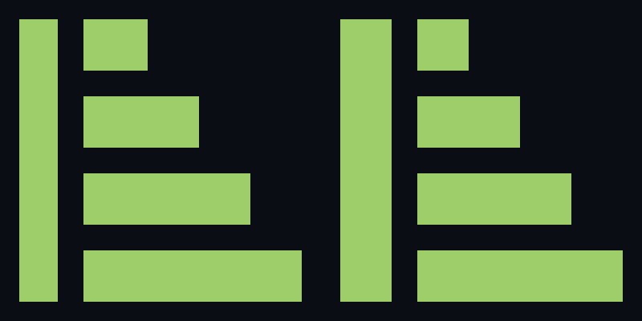

<p align="center">
  
</p>

# Drawing an identity with an agent

A compositor in this project got a name, a mark and a specification in an
afternoon. The process was the one a design studio runs — brief, directions,
critique, refinement, a system with rules — and there was nobody in the
studio. This is the record of it, written while it happened, because the
interesting part is not the mark. It is which steps changed.

The human in this is the client. He wrote one line of brief, chose a
direction, and rejected a detail. Everything between those three moments was
done by an agent with a terminal.

---

## 1. The brief

> "un logo per Flyback compositor con /design dai un brief adeguato"

That is the whole brief: a logo for the Flyback compositor, and write yourself
a proper brief for it. A studio would go back with a questionnaire. There was
no need to: everything a questionnaire asks for was already in the
repository — what the thing is, who it is for, what it sits beside, and, as it
turned out, the exact geometry of the mark it has to be a sibling of.

## 2. Ground truth instead of taste

The project already had a mark, called **Retrace**: four bars crossed by the
dark cut of a beam running back between two lines. A studio would have been
sent a PNG of it and would have measured the PNG.

The mark is not a PNG. It is a struct:

```rust
pub const RETRACE: Retrace = Retrace {
    grid: 44,
    bars: 4,
    thick: 8,
    gap: 4,
    cut: 12,
    minseg: 3,
    rest: -2,
};
```

Forty-four units square, bars eight thick with four between them, a cut twelve
wide that steps once per bar so its edge is a true 45 degrees, and a comment
above it explaining that five bars cannot shrink to 24 pixels and a mark that
changes shape when it shrinks is a patch rather than a system.

So the sibling relationship was not a judgement about whether two shapes look
related. It was arithmetic on numbers that were already written down, with the
reasoning behind them already written down beside them. **The design system
existed as source code before anybody called it a design system**, and the
first thing the agent did was read it.

## 3. Three directions, with the case against each

<p align="center">
  
</p>

The name is the brief. *Flyback* is what a television's horizontal deflection
does between two lines: the current ramps across the screen and then collapses
back in almost no time. The transformer named after it is the part that dies
when the line rate is wrong, which is why the compositor refuses a timing
outside the band. Three readings of that:

| | | |
| --- | --- | --- |
| **A** | The whole raster | A solid field with one unbroken staircase cutting back through it: the beam's return drawn as a single unbroken move, three units a row. |
| **B** | Mid-scan | Four bars with the last one stopping a third of the way across: the raster caught in the middle of being drawn. |
| **C** | The ramp | The deflection waveform itself: four bars stepping out, and a full-height stroke where the ramp resets. |

Each sheet carried a **For** and an **Against**, and the Against was written
before the client saw it. C's:

> *For* — says the name's engineering meaning rather than its picture, and
> cannot be mistaken for Retrace at any size. Reads as a bracket, which suits
> a thing that encloses an output.
> *Against* — the least literal of the three; someone who has never seen a
> deflection waveform reads it as an abstract monogram, not as a beam.

That is not modesty. A direction presented without its weakness is a
direction the client cannot actually choose between.

## 4. The choice

> "Ok per la C vai avanti"

Five words. Every studio's favourite kind of feedback, and the whole of the
human's second contribution.

## 5. The refinement, and why it was a number

<p align="center">
  
</p>

In the sketch the return stroke was six units wide. In the finished mark it is
eight — the same weight as a bar.

The argument is not "it looks better". It is that the stroke *is* a bar: the
same beam, travelling about a hundred times faster. At six units it was the
only edge in the mark that did not sit on the 8-thick, 4-gap rhythm, so the
mark had two weights in it and the small sizes showed it. At eight, every edge
in the drawing is on the same grid as Retrace, the silhouette is one weight,
and the shape still reads at 16 pixels, where 8 of 44 units is 2.9 pixels of
ink.

A refinement that can be stated as a rule is one the next person can apply
without asking.

## 6. The rules

Three sheets, in the order a studio would hand them over:

- **Construction.** The mark on its 44-unit grid with a four-unit rule, and
  the numbers beside it: bar thickness 8, gap 4, pitch 12, return stroke
  8 × 44, stroke to bars 4, bar widths 8 / 16 / 24 / 32, flush right at 44.
  Everything a whole unit. No hairline, no diagonal, no gradient.
- **Colour, space and misuse.** Phosphor green on the near-black the launcher
  uses, paper for a row of logos, black on light for print, a knockout for a
  badge. Clear space is four units — the gap again. Four things drawn
  deliberately wrong: rotated, gradient-filled, outlined, and with five bars.
- **Lockup and family.** The horizontal and stacked lockups, and the two marks
  side by side: Retrace's cut moving down and to the left, Flyback's ramp
  stepping down and to the right. One alphabet, two words.

There is one constraint behind all of it that no studio has ever been given:
**the mark has to be drawable by an electron beam on 240 scan lines**, because
this project's mark appears on the television it drives. That is why there are
no diagonals, no hairlines and no fractional units anywhere in the system. A
constraint that specific does more for a mark than a mood board does.

## 7. The critique, and how it was answered

The client looked at the finished lockup and wrote:

> "Mi sembra tutto disallineata la scritta wayland compositor sia a sinistra
> sia dentro e poi é illegibile nel contrasto."

Two faults, both real.

**The alignment.** JetBrains Mono is monospaced, so every glyph sits in the
same advance and each one carries its own left side bearing inside it. A
capital F at 230 px carries 18 px of bearing; a capital W at 52 px carries 1.
Set to the same x coordinate, the two lines are aligned on their origins and
misaligned on their ink by seventeen pixels, which is exactly what the eye
sees. The fix was to align on the ink: the second line starts 17 px further
right. Then it was checked rather than admired — the two bands were cropped
out of the rendered file and trimmed, and both now report their first ink at
the same pixel column.

**The contrast.** The second line was `#565f89` on `#0b0d14`, which is a hint
rather than a word. It is `#a9b1d6` now, still below the wordmark's weight so
the hierarchy holds.

And a third fault, found while fixing the first two and not reported by
anybody: the descender of the *y* in Flyback was running into the second
line's cap height. The word moved up 16 px and the line down 16, which keeps
the block centred on the mark.

The lesson of that round is not that the agent made mistakes. It is that the
critique was answered with a measurement — a number for the bearing, a number
for the correction, and a check that the correction landed — rather than with
another opinion. That is the part of studio practice that survives being
automated, and the part that gets better.

## 8. What the tools actually were

No image generator was used, and nothing here was drawn by describing it to a
model that paints. Every shape in this identity is a list of rectangles on a
44-unit grid, written as SVG by hand, because the system's own rules say the
mark is whole units or it is not the mark.

The rounds ran on a canvas: each sheet is a self-contained HTML artboard,
several of them laid out on one pan-and-zoom surface, published to a link the
client opens on his phone. Version 1 was the three directions. Version 2 was
the refined mark with its rules. Version 3 was the critique answered. The
working files are in this repository under
[`docs/design/flyback-mark/`](design/flyback-mark/), including the two
directions that were not chosen, because a process you cannot inspect is a
claim rather than a record.

The deliverables are here too: `docs/flyback-mark.svg` and its `currentColor`
variant, which are rectangles and nothing else; `docs/flyback-logo.svg`, which
carries live type and so needs the font; and `docs/flyback-logo.png`, which is
what that renders to.

## 9. What this does and does not show

It does show that an agent can hold a design system rather than produce an
image: read the constants that already govern the product, extend them,
write down the rules it extended them by, and answer a critique with a
measurement.

It does not show taste. The three directions were three readings of one
engineering fact, and a studio with a different sensibility would have
brought three that had nothing to do with waveforms. The client's five words
did the part no amount of arithmetic reaches.

What it changes is the cost of the parts in between. The brief, the ground
truth, the directions with their honest tradeoffs, the specification, the
assets, the critique round: an afternoon, in the same repository as the thing
being branded, with every decision written down beside the code that made it
necessary.

---

*Everything in this document is experimental and part of one hobby project.
The mark belongs to that project; the process is the interesting part.*
