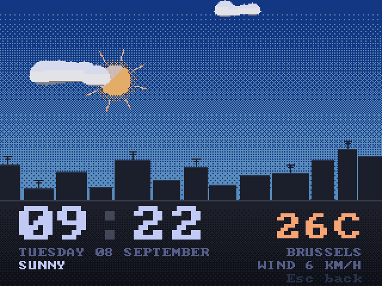
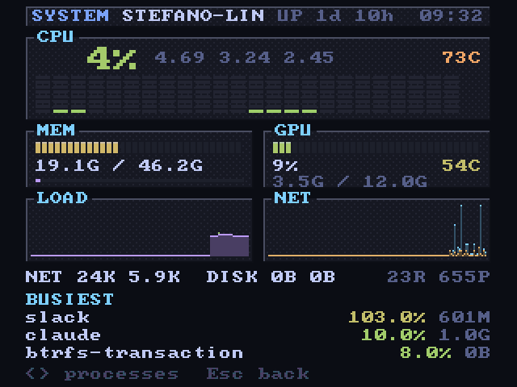

# The launcher, screen by screen

A 320x240 framebuffer drawn sixty times a second, no shader faking a tube. The
theme comes from Omarchy's own colors; every installed theme is available and
switches with a blend.

- **Boot.** Power surge and roll, a BIOS style POST with live data, then the
  mark revealed top down behind a beam bar, the dark cut of the beam's return
  travelling across it, a chime, and the wordmark etched by a laser
  (TerminalTextEffects' `laseretch`, ported pixel by pixel) while a Mode 7
  floor unrolls under it and the word lands on the glass. The mark's cut
  returns once every nine seconds, wherever the mark is drawn.
- **Games.** Systems with console pictures, games with box art from the
  libretro thumbnails (matched by title when the file names carry no region
  tags, so a RePlayOS style set gets its covers too; `omacrt library
  covers` fetches them all at once), collections, favourites, recent. Arcade
  files named after the emulated set, `mslug` for Metal Slug, are read
  through the databases RetroArch ships, so those lists show titles and find
  their covers as well. `X`
  opens the **cover
  flow**: the selected cover large on a shelf, the neighbours receding at an
  angle, everything mirrored on the floor, sliding with inertia.
- **Search.** `/` filters the open list as you type; from the home menu it
  searches the whole collection, tens of thousands of titles answering within
  a frame. Pads get
  the same with the left trigger and an on screen keyboard, and jump letter
  by letter with the shoulder buttons.
- **Launch ritual.** A cartridge slides in (a disc spins up for CD systems),
  scrape and click, the picture collapses to a line, the emulator takes over
  with the line count the system wants. RetroArch runs with its own menu and
  notifications off, save state on exit and resume on start.
- **Resume or start again.** A game left in the middle asks which it is to be:
  carry on from the state written on exit, or a new session that leaves that
  state alone.
- **Pause menu.** Select + Start, the home button, or F1: resume, save state,
  load state, rewind, fast forward, slow motion, reset, back to the launcher. The compositor presses
  RetroArch's real hotkeys, so nothing depends on a network command. Every
  game with a save state carries a small arrow and says when it was left.
- **Music.** On top of cliamp, started as a daemon when needed: the radio
  stations of your country, every country and genre of the Radio Browser
  directory, favourites, history, and any provider set up in cliamp (Spotify,
  YouTube Music, Qobuz, Plex, Jellyfin). The now playing screen is a **hi-fi
  deck**: a cassette whose reels turn with the music, or a radio dial whose
  needle glides to the station through a burst of static, two VU meters with
  inertia. Six idle seconds later the screen becomes a **visualizer** driven
  by cliamp's spectrum and a kick detector: Mode 7 equalizer, silk ribbons,
  oscilloscope, starfield, plasma, pixel fire, spectrum tower. Synced lyrics
  when cliamp has them, a sleep timer, and the selection band of every list
  breathing with the beat. The album art of a Spotify track and the logo of a
  radio station arrive on the cassette label, the record label and the dial.
  An **equaliser** page moves the engine's ten bands one decibel at a time,
  or takes one of its presets.

  
  
  

- **Videos.** Local films through mpv with a themed on screen display and a
  fit pipeline for the tube (480i or 576i by frame rate, pulldown or PAL
  speed-up for film, letterbox or crop, a safe area, a retro 240p mode).
  **YouTube** on the television: search from the tube, watch later, recently
  watched, the link in the clipboard, or `omacrt watch URL` from a
  terminal; streams are fetched at 480p, all a 240 line tube can show.
- **Photo frame.** The house's photographs on the television, from an Immich
  server on the same network: this day in the years before, an album or the
  favourites, with the place, the date and the faces the server already knows.
  Nothing over the picture, or the time and the caption in the corners, or the
  whole ambient page with a clock, the weather, the next appointment and what
  is playing. A photograph that fills the screen drifts a pixel a frame while
  it is up, so it never looks like a photograph of a television, and one held
  upright is fitted whole against a blurred copy of itself rather than black
  bars. The prepared pictures are the frame's own collection, so it works with
  the server switched off.
- **The weather, drawn.** The ambient page is a window, not a text field: the
  sun crosses the arc between the real sunrise and sunset and the moon takes
  the same path at night, clouds drift in three layers at the speed of the
  real wind, rain slants with it and breaks on the ground, snow wanders down,
  fog rolls in bands, lightning lights the frame, and a town sits along the
  horizon with its windows coming on after dark. Every gradient is an ordered
  dither, because a console with a fixed palette had no other way. It can
  have the sound as well, off by default under Settings, Sound: rain with
  drops on it, gusting wind, thunder behind a downpour, birds by day and
  crickets by night, all synthesized and then held at 8 kHz and quantised the
  way a sample was in 1990. That page is where the launcher's other noises
  are switched off too.
- **System monitor.** What the machine is doing, drawn as a 16 bit status
  screen: a bank of little meters, one per processor, memory and graphics on
  bevelled plates, a minute and a half of history for load and network, the
  rates and the busiest processes. Straight out of `/proc` and `/sys`.
- **When it is left alone.** Four pages can have an idle television: the
  wordmark under a text effect, the photo frame, the weather, and the system
  monitor. One of them keeps the screen, or several take turns every so many
  seconds, switched on and off a page at a time under Settings, Screensaver.
  Music playing takes the screen back for the visualizer, because a page
  showing the time is a poor answer to a room with music in it.
- **Pads.** SDL's database plus a wizard on the tube for the pads it does not
  know: press each control once and it is mapped for good.
- **Sound.** Every click, whoosh, crackle and scrape is synthesized at
  startup. No background music of its own.

Keyboard and pad bindings are in [`docs/input.md`](input.md); the
launcher's flags and offline rendering in [`shell/README.md`](../shell/README.md).

An idle television is a window. The ambient page draws what the weather is
actually doing: the sun crosses the arc between the real sunrise and sunset,
clouds drift at the speed of the real wind, rain slants with it and breaks on
the ground, lightning lights the frame, and after dark the town along the
horizon turns its windows on.

  

The other side of an idle set is what the machine itself is doing, drawn as a
16 bit status screen: a bank of little meters, one per logical processor, that
eases up fast and falls back slowly the way the meters on an amplifier do,
memory and graphics on bevelled plates, a minute and a half of history for
load and for the network, and the busiest processes at the foot. All of it out
of `/proc` and `/sys`.

  

## The library scans anything

Point `omacrt library scan` at a disk and it works out what every file
is: extension, the words in the folder names, disc image signatures, the
names inside zips. No renaming, no fixed folder scheme. Regional variants
collapse onto one title and systems show up when they have games. Details in
[`docs/systems.md`](systems.md), the display mode per system in
[`docs/video-policy.md`](video-policy.md).
