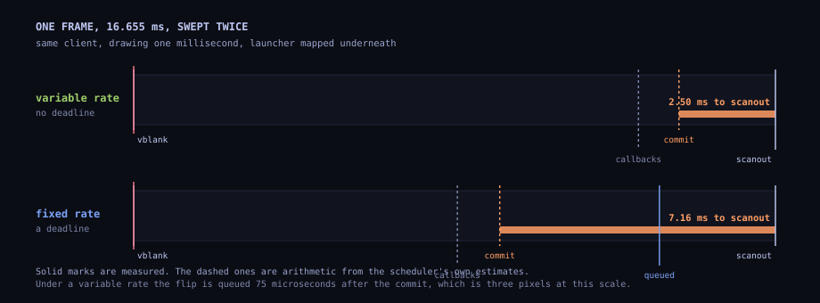

  

A television is not a monitor that has aged badly. It is a different machine,
and the part of it that matters here is a tuned circuit: a flyback transformer
and an output transistor, sized for one line frequency and destroyed by
another. Everything below happens inside that constraint, and the compositor
this study is about is named after what the circuit does fifteen thousand
seven hundred and thirty times a second.

## 1. What it is

**Flyback** is a Wayland compositor. One process, one thread, one event loop,
3616 lines across four files, built on smithay 0.7.[^1] It is part of OmaCRT,
a launcher for a television, and it is the piece of that project that touches
hardware.

What makes it unlike other compositors is not its size. It is the output it
takes. A desktop compositor is given a set of outputs by the system and
arranges windows on them. A kiosk compositor puts one window on one of those
outputs. Flyback does neither: it asks the desktop for a connector the desktop
has been told to leave alone, receives a file descriptor that makes it master
of that connector and nothing else, programs a timing no desktop would set,
and owns the scanout from then on.

The desktop keeps running. That is the whole point, and it is the thing none
of the established ways of driving a CRT from Linux can do.

Four clients use it, all local and all started by the same project: the
launcher, RetroArch, mpv, and a measuring instrument that exists only to take
the numbers in this study. They reach it through `WAYLAND_DISPLAY=wayland-crt`.

**This is experimental.** It drives hardware that a wrong signal destroys, and
section 8 describes the guard that refuses one, which exists because the
guard did not exist for the first several months of this project's life.

## 2. Why a desktop will not do it

A television at 15 kHz wants a modeline whose line frequency is about a
quarter of the slowest thing any monitor has asked for since 1987. Three
separate refusals stand between that and a running desktop, and it is worth
separating them because only one of them is about the mode.

**The compositor will not set the timing.** No desktop compositor exposes an
arbitrary modeline, and the ones that expose custom modes validate them
against what a monitor plausibly wants.

**The compositor will not stop managing the output.** Even where a mode can be
forced, the desktop keeps ownership: it will re-probe, re-arrange, apply its
own scaling, and put its own idea of a cursor on the screen.

**The compositor will not give away the scanout.** Frame scheduling, the thing
section 5 is entirely about, is the compositor's own business. A client cannot
decide when its buffer latches.

There is one supported answer to all three at once, and it was written for
something else.

## 3. Taking the connector, and what a lease actually grants

`wp_drm_lease_v1` exists because virtual reality headsets are displays that no
desktop should ever try to use as a desktop. A connector marked non-desktop is
offered for leasing instead, and a client that takes the lease gets a DRM file
descriptor that is master for that connector and its CRTC.[^2] The protocol's
own wording is general — a compositor "will not use this output at all and
will make it available for leasing" — but every user of it in the wild is a
headset.[^3]

A television is not a headset, and the kernel does not need it to be. The
non-desktop flag comes out of an EDID vendor block that Microsoft specified
for head-mounted and specialised displays, and the parser sets the flag for
versions 1 and 2 unconditionally and for version 3 when the block does not
claim desktop usage.[^4] This project writes that block into a fabricated EDID
and loads it as a connector override, so Hyprland stops configuring the
connector and starts offering it.

What comes back is worth being precise about, because "we take over the
screen" makes it sound more dangerous than it is. A lease is a `drm_master` in
its own right, a lessee, holding exactly the objects named in the lease and
nothing else.[^5] Flyback can set a mode on that connector and flip its
planes. It cannot touch the desktop's outputs, and the desktop cannot touch
its. When the lease is revoked the connector goes back.

No trace was found of anybody else leasing a television this way. That is not
a claim of primacy, it is a statement about a search.

## 4. The EDID we write ourselves

Section 3 said the connector is marked non-desktop and left it there, as if
marking were a thing one does. It is not. A connector's classification comes
out of the display's own EDID, and a television behind a converter does not
send anything useful. So this project composes one.

**What an EDID is, for this purpose.** 128 bytes of base block, optionally
followed by extension blocks, read over the display data channel at probe
time. The one that matters here is the CTA-861 extension, which carries a
collection of data blocks and then a list of detailed timings. Each data
block has a tag and a length in its first byte, and tag 3 is a vendor block:
three bytes of registration identifier followed by whatever that vendor
wants.

**The first vendor block is Microsoft's, and it is what does the marking.**
Microsoft specified a block for head-mounted and specialised displays, and
the kernel's parser reads its version byte: versions 1 and 2 mark the
connector non-desktop unconditionally, and version 3 does unless the block
explicitly claims desktop usage.[^5b] So the block this project appends is
tag 3, length 21, the Microsoft identifier `5C 12 CA`, version `02`, a flags
byte, and a sixteen byte container identifier derived from a name rather than
invented, so that two televisions in one house would not claim to be the same
device.

That is the whole mechanism. **It changes how the kernel classifies a
connector, and nothing about what is sent down it.** Every other decision in
this project — the modeline, the line rate, the refusal guard in section 10 —
is unaffected by it. It is worth saying plainly because rewriting a display's
identity sounds more dangerous than it is.

**The second vendor block is AMD's, and it is for section 7.** Nine bytes:
`68 1a 00 00 01 01 <min> <max> 00`. A tag and a length, the AMD registration
identifier, a version, the two refresh rates in hertz, and a flags byte.

Those bytes were worked out by trying them. That is the kind of admission a
technical piece usually buries, so here is the reason, which turns out to be
the interesting part: **there is no code in the kernel that parses them.** The
CEA extension block is handed to the display microcontroller and the firmware
hands back a version and two rates.[^6] There was nothing in the tree to read,
and `edid-decode` reading the result back as "Vendor-Specific Data Block
(AMD), Version 1.1" was the only confirmation available.

The flags byte is left at zero deliberately, and that turns out to be
load-bearing rather than tidy. Monitors that set it are asking for a
conversation over the monitor control command set, and when a block declares
such a control code the driver goes on to require that the display actually
support FreeSync over MCCS, and **revokes** the capability when it does
not.[^7] A television does not answer. The empirically chosen zero was right
for a reason nobody had looked up.

What the declared range has to satisfy is two checks, and they are not the
same check. To be considered capable at all, the driver wants the declared
range to be **strictly greater than ten hertz**.[^8] To reach the active
variable state, the FreeSync module first caps the declared maximum at the
mode's own nominal rate and then wants what is left to be **ten or more**.[^9]
So a range of 55 to 66 declared against a 60.041 Hz mode becomes 55 to
60.041, a range of five, and is refused in silence. The range this project
ships is 48 to 62 for exactly that reason, and the generator refuses to emit
anything narrower than eleven.

**Then the whole block is rebuilt and the checksum recomputed**, because an
EDID whose bytes do not sum to zero is discarded, and the new one is handed
to the kernel through `edid_override` in debugfs. That is not enough on its
own: the kernel read the real EDID when the connector was probed and is not
going to read it again because a file changed. So the script simulates an
unplug and a plug through `trigger_hotplug`, and the connector comes back
carrying the identity we wrote for it. Undoing it is the same two steps with
`reset` written instead.

The whole thing is 87 lines of Python and 104 of shell, and it is the piece
of this project most likely to be useful to somebody who does not own a
television: marking a connector non-desktop is how you take *any* output away
from a desktop compositor.

## 5. What the protocol gives a compositor to work with

Everything in the next section is built out of a small number of Wayland
mechanisms, and the shape of what is possible comes directly from them.

**A surface is double-buffered.** A client accumulates pending state — a
buffer, a damage region, a scale, a callback request — and `wl_surface.commit`
applies all of it at once. So a commit is an event with a timestamp, and it is
the only moment at which a compositor learns that a client has finished
drawing. Every scheduling decision in Flyback starts in the commit handler.

**A role decides what a surface is.** Flyback implements `xdg_shell` and
configures every toplevel fullscreen at the output's size, so a client is told
3520x240 and draws into it. It also implements `wp_viewporter`, which is how
the launcher draws 320x240 and has it scaled to the output without knowing the
output's real width. `xdg_popup` is configured so that a client making one is
not broken, but popups are not mapped or drawn.

**The frame callback is the only pacing lever there is, and it carries no
information.** A client asks for one callback per frame it intends to draw,
and the compositor answers `done` with a timestamp meaning *now*. That is the
entire vocabulary. A compositor cannot say "draw a frame intended for time T",
and a client cannot say "I would like to run at 59.92 Hz". Everything in
section 6 is therefore a decision about *when* to send `done`, because that is
the only thing a compositor is allowed to decide.

That is also why this project's refresh rate has to be asked for on a private
control pipe rather than negotiated: there is no protocol for a client to say
what rate it wants.

**Except that now there is, and Flyback does not implement it.**
`wp_commit_timing_v1` lets a client put a time constraint on a content update
— present this as close as possible to, but not before, time T — and
`wp_fifo_v1` gives first-in-first-out semantics without the client having to
guess. Both landed in wayland-protocols 1.38, both are implemented by Mutter
and KWin, and both are already in smithay, which means adding them here is a
delegate and a handler rather than a project.[^15] That is the most obvious
thing this compositor should do next, and the reason it has not been done is
that nothing on the tube speaks them yet.

**`wp_presentation` is the answer in the other direction.** Without it a
client cannot know when its frame reached the screen and has to guess. Flyback
implements it on `CLOCK_MONOTONIC`, fed by the timestamp the kernel puts on
the page flip event, and claims `HwClock | HwCompletion` in the feedback flags
only when the driver's stamp really is on the monotonic clock rather than an
estimate. mpv has used this for years; RetroArch gained it in July 2026.[^16]
Getting it working was also the first piece of this whole study, because
without it there is nothing to measure with.

**Buffers reach the plane without a copy.** `zwp_linux_dmabuf_v1` with default
feedback lets a client hand over a GPU buffer directly; a buffer that cannot
be imported is refused through the protocol's own notifier rather than taken
and dropped.

**And what is deliberately absent shapes it too.** There is no pointer and no
touch on the seat — the seat has a keyboard and nothing else — and Flyback
opens no input devices at all. The pad is read by the programs themselves
through evdev. A compositor that never opens libinput is not one any desktop
wants, and it is one less thing between a button and a picture.

## 6. The scheduler, and why a variable rate has no deadline

A compositor answers three questions once a frame: when to tell the clients
they may draw, when to draw itself, and when to put the result in the air. The
usual answer to all three is "at the vblank", which is safe and costs most of
a frame.

**At a fixed refresh there is a deadline.** A flip has to be queued before the
vblank or the picture waits a whole frame. So Flyback draws at the last safe
moment — one frame less a margin taken from what recent frames actually cost —
and tells the clients early enough that their commit arrives before that,
which it works out as twice their own measured drawing time plus a slack.
Telling a client at the vblank instead, which is what this compositor used to
do, throws away almost a whole frame: the flip goes out before the client has
committed, and the client's picture then waits for the frame after. This is
the same idea GroovyMAME calls frame delay, done for every client at once
rather than inside one emulator.

**At a variable refresh there is no deadline at all.** A flip that arrives
after the frame's minimum length simply makes that frame longer, and nothing
is dropped. So nothing is held back: the compositor draws the moment a client
commits, and tells the clients as late as it dares.

The one thing it must never do under a variable rate is draw at the vblank.
Anything committed while the last flip was in flight is about to be superseded
by the frame the client is drawing now, and flipping it puts a stale picture
in the air that the fresh one then waits behind. That single mistake cost a
frame and a half.

  

Here is the difference, measured on the compositor's own trace rather than
drawn. The same client in both, drawing one millisecond, 200 frames each,
microseconds as 5th / 50th / 95th percentile:

| | variable rate | fixed rate |
| --- | --- | --- |
| commit to flip queued | 55 / **75** / 244 | 4069 / **4144** / 13905 |
| flip queued to vblank | 2238 / **2423** / 2487 | 1531 / **1643** / 1894 |
| vblank interval | 16641 / 16655 / 16668 | 16637 / 16655 / 16672 |

Under a variable rate the commit is drawn and queued in 75 microseconds,
because there is nothing to wait for. Under a fixed one it sits for four
milliseconds waiting for the deadline, and the tail says that on some frames
it sat for nearly the whole frame.

Three estimates feed all of this, measured rather than assumed, because
between telling a client to draw and seeing its picture scanned out sit a
wake-up, a draw, a flip and a hardware latch that no constant would get right.
`render_cost` is what this compositor takes to draw and queue. `client_cost`
is what a client takes between being told and committing. When a rate has been
asked for by name, `rate_trim` is the measured error, a quarter of it
corrected each frame.

### What was wrong with that, and how it was found

`client_cost` was one number for the whole compositor. Frame callbacks all go
out together, so a single estimate is really the slowest client on the tube —
and with the launcher mapped underneath a game, that is the launcher, which is
not the one being watched.

It was found by re-running the instrument and getting the wrong answer. A
client that draws in a millisecond measured **18.70 ms** from commit to
scanout with the launcher mapped, and **3.56 ms** with the launcher stopped.
Same compositor, same client, one window underneath that nobody can see.

The estimate is per window now, kept in the window's own user data, and the
callbacks are paced by the window on top: the one being looked at. A window
underneath answering late costs nothing; the window on top answering late
costs a frame. Two more changes followed from chasing the tail: a commit from
a window that is not on top marks the frame dirty but does not decide when the
flip goes out, because flipping for a window nobody can see takes the slot the
top window's next commit needs; and a window's first measurement replaces the
whole-frame assumption instead of losing to it for the fifty frames a decaying
maximum takes to come down, which is the half second anybody actually watches.

With the launcher mapped underneath, the fast client now measures **3.79 ms**,
against 3.56 with the tube to itself. The cost of a hidden window is 0.23 ms.

## 7. A variable refresh rate, on a television from 1998

A set's horizontal rate must not move: the flyback transformer and the
deflection circuit are tuned for one. The vertical rate is another matter,
because the vertical oscillator re-triggers on sync. So every refresh an
emulation asks for — 59.92 for a Mega Drive, 60.0988 for a NES, 57.5 for one
arcade board or another — is reachable by changing the vertical total alone
and leaving the line rate at 15730.8 Hz.

That is exactly what adaptive sync does in hardware: it stretches the vertical
blanking and touches nothing else. The question is whether a consumer
television from 1998 follows it, and the answer had to be found rather than
looked up. The one prior report of adaptive sync on a CRT is on multisync PC
monitors rather than on televisions.[^10]

**The driver side takes two things, and one of them is not what this project
said for a week.** To reach `VRR_STATE_ACTIVE_VARIABLE` the driver wants the
connector to be `freesync_capable` with the mode's refresh inside the declared
range, and the CRTC's `VRR_ENABLED` property set.[^11] That is all.

This project published, for a week, that `amdgpu.freesync_video=1` was also
required. It is not. That parameter gates a different mechanism: a seamless
change of the front porch that skips the modeset and produces
`VRR_STATE_ACTIVE_FIXED`.[^12] Tested directly on this chain, with the
parameter set and a timing shaped exactly as the driver's own condition
requires — same clock, same htotal, vertical total moved, `vsync_start` moved
with it, sync width unchanged[^13] — the change still cost 222.8 and 229.1 ms.
The seamless path does not trigger here, and the parameter has not been shown
to do anything.

**With the range declared, the timing generator is programmed with room.**
`amdgpu_dm_dtn_log` reported `vmin 261 vmax 327` for the tube's timing
generator. Those registers hold the total minus one,[^14] so that is a
vertical total of 262 to 328 lines: 60.041 Hz down to 47.96 Hz, at a line rate
that never moves.

**And the scanout follows.** Asked for a rate by name and measured as the
median of the last 300 vblank intervals, with fifteen seconds of settling:
60.041 asked gives 60.04, 59.92 gives 60.02, 57.5 gives 57.59, 55 gives 55.01.
Ask for 50 and it is held at 55, and says so — which brings us to the part
that is a property of the television rather than of any software.

  

### Where the set stops following

A television's vertical deflection follows a longer frame only so far, and
past that the picture loses height and keeps it for as long as the rate does.
Filmed on the BeoCenter 1, each step held for eight seconds, the height
measured against the picture's own width so that the camera's drift cancels —
which works because the width cannot change while the line rate does not:

| refresh | frame longer by | height | brightness |
| --- | --- | --- | --- |
| 59.92 Hz | +0.2% | reference | 170.4 ±1.7 |
| 57.5 Hz | +4.4% | -0.4% | 169.4 ±1.4 |
| 55 Hz | +9.2% | -0.6% | 169.6 ±3.2 |
| 50 Hz | +20.1% | **-11.5%** | 162.8 ±4.3 |
| back to 60.04 Hz | +0.0% | -0.1% | 170.7 ±0.8 |

The last row is the control: it repeats the first, and its coming back to
-0.1% is what says the -11.5% was the television rather than the camera. So
the useful range on this set is 60.04 Hz down to about 55, and the whole NTSC
family sits four times inside it. PAL at 49.70 is outside it and does not need
to be inside: a PAL frame is 288 active lines and wants its own modeline
anyway.

The brightness column is the other half of the answer. A phosphor's brightness
depends on how long it is left between refreshes, so a television whose frame
length keeps changing will pulse. Steady to within two parts in a hundred at
every step is what that looks like when it is not happening.

Where a set gives up is a calibration, like the picture shift, and it lives in
the configuration as `output.vrr_min_hz`. Nothing asks the tube for a slower
rate than that, however slowly a program runs.

### The rate has to be asked for, not discovered

Put an emulator on the tube whose content rate is not the compositor's cadence
and the two beat: half the frames end at the hardware's minimum vertical total
and half run to its maximum, four milliseconds apart, and the picture
flickers visibly. Pacing the frame callbacks to the client's own commit
interval rather than to the mode's period removes it — on a Mega Drive core
the step between one frame and the next fell from 4283 microseconds to 24.

What that does not do is let a program choose a rate. A client paced by frame
callbacks runs at the cadence it is given, and the cadence is taken from the
cadence it runs at, so wherever it settles is where it stays. Taking the brake
off lets the core set the rate, and on an NTSC title it does exactly that; on
a PAL one RetroArch then had nothing holding it at all and ran at 80 Hz,
faster than the hardware's shortest frame, and the pacing collapsed again.

So the rate is asked for: `rate 59.92` on the control pipe. The launcher knows
which system is running and what that system's refresh is, and telling the
compositor is one line on a pipe it already has.

## 8. How any of this is measured

Every number in the next section comes from one program, and it is worth
describing before the numbers rather than after, because a measurement is
only as good as what it can and cannot see.

**The problem is that the two ends of the measurement are usually on
different clocks.** A button press is timestamped by the kernel's input
layer. A frame reaching the screen is timestamped by the display hardware's
vblank. Comparing them means getting both onto the same clock, and then
getting the second one out to the program doing the comparing.

`shell/src/bin/latency.rs` does that, in about 1400 lines, behind a feature
flag so that it is absent from every build anybody installs.

**It makes its own pad.** A virtual gamepad through `uinput`, so a press can
be generated at a chosen instant rather than waited for. Then it opens the
event node the kernel creates for that pad and sets `EVIOCSCLOCKID` to
`CLOCK_MONOTONIC`, which is the clock DRM stamps a vblank with. Both ends of
the measurement are then on one clock, and the difference is real rather than
approximate. There is a tenth of a second of waiting between creating the
device and opening its node, because the kernel makes the node before udev
hands it to the `input` group, and the first open is otherwise refused.

**It gets the other end through the protocol.** The vblank timestamp reaches
it as `wp_presentation` feedback, which is the reason section 5's protocol
work came first: without it there is nothing to measure with. The instrument
also checks the feedback's flags and reports how many of its samples carried
`HwClock | HwCompletion` rather than an estimate. In the runs published here
that is 300 of 300.

**It presses at random points in the frame.** This is the part that is easy
to get wrong. A test that presses on the frame callback measures the same
instant of the frame every time, and produces a beautiful distribution that
means nothing: real input arrives whenever it arrives. So the default mode
spreads its presses across the frame, and the distribution has the half-frame
wait in it because a real one does too. The paced mode, which draws on the
frame callback the way a program paces itself, is a different measurement and
is labelled as one wherever it appears.

**It says what it cannot see.** The report ends with the measured cost of the
instrument's own work reading the pad and drawing, which is 0.01 ms, and with
a line stating that a real pad adds its own polling in front of everything,
one to eight milliseconds depending on its rate, which belongs to the pad. It
also decomposes its own median against half a frame, so that the part nobody
can remove is separated from the part this compositor is responsible for.

What is left outside even that: the converter's own pipeline, which has no
frame store and is sub-microsecond, and the phosphor, which lights within
microseconds of the beam arriving. On a set with no panel and no scaler,
"the start of scanout" is very nearly "the picture on the glass", and that is
the property that makes this chain measurable in software at all. On an LCD
the same program would be measuring something else and a photodiode would be
compulsory.

**And it draws its own test card.** A separate mode puts a self-driving
pattern on the tube for filming: a clapper to synchronise the film with the
log, steps counted in frames rather than in seconds, and the word END drawn
from a bitmap font so that a recording carries its own label. The height and
brightness table in section 7 was measured from film shot that way.

`--dump` writes every sample to a file, one millisecond figure per line, in
the order taken. That is how the three hundred samples behind section 9 come
to be published rather than summarised.

## 9. What it costs

Every figure here was taken on the chain in the conditions block at the top,
with the launcher mapped underneath, because a program on this television is
never the only client on it.

**Commit to the start of scanout**, for a client that draws on the frame
callback the way a program paces itself:

| the client takes | fixed rate | variable rate |
| --- | --- | --- |
| 1 ms | 6.98 ms | **3.79 ms** |
| 2 ms | 7.90 ms | **4.61 ms** |
| 4 ms | 9.79 ms | **6.54 ms** |

The launcher end to end reports **2.0 ms**, and 4.5 ms with every core on the
machine busy.

**The starting point is a recipe rather than a memory.** Turn the three
switches off — `FLYBACK_LATE_DRAW=off`, `FLYBACK_MARGIN_US=off`, and the
variable rate off, which together are what every other compositor does — and
the same client on the same machine measures **33.36 ms, two frames exactly**,
with the launcher's own figure at 33.1. Anybody with this hardware can run
both halves.

**Press to picture**, from the kernel's timestamp for a button press to the
start of scanout, 300 presses at random points of the frame: **best 1.46,
median 10.19 (0.61 of a frame), 95th 17.52, worst 18.21 ms.** All three
hundred samples are published rather than summarised, because five numbers are
a claim and a distribution is something to disagree with.

The decomposition matters more than the median. **8.33 ms of it is half a
frame** — what any commit at a random phase waits for the next vblank, whoever
is compositing. The compositor's own contribution is the 1.9 ms above that.
The instrument measures its own overhead at 0.01 ms. This is a virtual pad
made with `uinput` and read back through evdev with the clock set to
`CLOCK_MONOTONIC`, so both ends of the measurement are on the clock the vblank
uses; a real pad adds its own polling in front, one to eight milliseconds by
its rate, which belongs to the pad.

**A mode change, for comparison**, from the request to the first vblank after
it, with the television dark for all of it:

| what moved | first vblank |
| --- | --- |
| nothing: the same timing re-applied | 4.4, 8.8, 9.7, 15.5 ms |
| the vertical total alone | 196.5, 196.8, 206.8, 212.2 ms |
| the whole standard, NTSC to PAL and back | 182.4, 192.9, 216.7, 226.1 ms |

182 to 229 ms, and it does not matter how little of the timing moves. That is
the cost the variable refresh rate avoids, and the first row is what says the
cost is the modeset itself rather than anything in this compositor.

### Four of these numbers were wrong until the day before this was published

Nothing from this project had been published outside its repository when every
claim in it was checked again. Four did not survive, and the checking found
two defects that using the software had not.

The cost of a mode change was published as 166 to 190 ms. It could not be
reproduced from any log, because the clock meant to measure it was declared,
zeroed and read, and **never assigned a value**: the line it feeds had never
been printed in the life of the project. Armed, it gives the table above.

Press to picture was published as a median of 20.4 ms. That reading predates
the scheduling fixes in section 6, which were made the same day.

The refresh rates the tube was given were published to three decimal places —
59.922, 57.499, 55.000 and 49.999 Hz — by an instrument that does not exist
here, and one of the four was below this project's own floor and would have
been held at it.

And `amdgpu.freesync_video=1` was published as required, which section 7 has
already dealt with.

The second defect: the two explanations printed by the `rate` command were the
wrong way round. They compare periods rather than frequencies, so a longer
period is a slower rate, and asking for a rate below the floor answered "the
mode itself is no faster than that" — the opposite of what had happened.

The full record, voice by voice with every kernel claim pinned to a file and a
line, is in the repository.[^17]

## 10. What it does not do

Stated plainly, because a compositor that lists only what it has is a
brochure. No XWayland. No pointer, no touch, no input devices of any kind. No
layer shell, no decorations, no window rules; the stacking order is the whole
of the window management. No clipboard, no primary selection, no drag and
drop. No multi-output: one leased connector, one CRTC, one mode, and two
televisions would need most of this rewritten. No fractional scale, no HDR, no
colour management, no explicit sync, and no commit timing or fifo yet. **It is
not a general-purpose compositor and should not be used as one.**

Three absences deserve more than a list.

**Tearing.** `wp_tearing_control` is the other road to low latency and it is
not taken. On a 15 kHz set a torn frame is visible across a third of the
picture, and the scheduling in section 6 recovers most of the same time
without it.

**Interlace.** A 480i modeline on this chain is *accepted*: the modeset
returns without error, the converter keeps its lock, and the television shows
a narrow strip, because the timing is programmed as interlaced and scanned out
progressively at a rate no television locks to. Five separate things in the
current upstream tree stand between that modeline and a picture on DCN 3.2.
The interlace flag is never copied out of the DRM mode into the timing the
display core uses.[^18] The timing validator returns false for any interlaced
timing, under the comment *"Temporarily blocking interlacing mode until it's
supported"*.[^19] The register that enables interlacing is present in the DCN
1 register list and absent from DCN 3.2's, although the code that would write
it is generation-independent and already there, and AMD's own headers for this
ASIC carry the register and its enable bit.[^20] The mode validation library
this generation uses doubles the vertical ratio for an interlaced timing when
the ASIC does not claim progressive-to-interlace support, which this one does
not.[^21] And a line buffer field that exists for exactly this is never set
from the timing.[^22] This project decided not to require a patched kernel, so
it does not have interlace.

**Beam racing.** Drawing the frame just ahead of the electron beam is the last
real latency win available, and it exists — in GroovyMAME and in WinUAE, on
Windows. On Linux it never has: RetroArch has had a bounty standing for it
since 2018,[^23] and what landed in 2025 is the opposite thing, a shader that
*simulates* a CRT's rolling scan on a high-refresh LCD.[^24] The reason nobody
built it is that beam racing needs ownership of the scanout, which a desktop
compositor denies, and a leased connector does not. **So this is a setup where
it could be built, and it has not been built here either.** That sentence is
the whole of the claim.

It was also decided against on evidence rather than deferred vaguely. Beam
racing attacks the emulator's own frame production, not the compositor's
scanout, which is why it lives inside MAME and inside WinUAE rather than in a
window system. The measurement that settled it is in section 8: what remains
between a commit and the glass is 0.23 of a frame, and half of what remains
between a button and the glass is the wait for the next vblank that nobody can
remove.

## 11. Beside the others, and where that leaves it

There is a well-populated world of Linux retrogaming on CRTs, and most of it
is older, more complete and better tested than this. **If you are willing to
dedicate a machine, use [GroovyArcade](https://github.com/substring/os) or
[Batocera](https://wiki.batocera.org/batocera-and-crt).** They are mature,
they have communities, and they solve the problem completely. **If you want
the most faithful hardware behaviour money can buy, use a MiSTer**, whose own
documentation puts its scaler at four display lines in its fastest mode, about
a third of a millisecond, on top of a core that is the console's own
timing.[^25] A MiSTer is faster than this and always will be, because there is
no operating system in it.

One rule for the comparison: the numbers in this study are measured here with
the instrument in the repository, and everybody else's are quoted from their
own documentation or left out, because we do not own their hardware.

| | what it is | the machine is |
| --- | --- | --- |
| GroovyMAME / Switchres | a MAME fork and the modeline engine under it, the origin of most of this craft | whatever you run it on |
| GroovyArcade | an Arch-based OS built around it, with a patched kernel for 15 kHz | a CRT machine |
| Batocera + the CRT script | a general retro distribution plus a community script | a CRT machine |
| Lakka | a RetroArch appliance, with CRT-tuned Raspberry Pi images since 6.1 | a CRT machine |
| MiSTer | an FPGA that reimplements the consoles themselves | a console |
| **Flyback** | a compositor that takes one connector from the desktop | **still your desktop** |

Flyback is the only row that is a component rather than a system: no frontend,
no game database, no installer, no community. And the last column is the whole
of the difference. Every other row answers *"how do I build a machine for a
CRT?"*; this one answers *"how does a machine I already have grow a CRT?"*

**Where Switchres is better than what is here**, without hedging: it computes
a modeline per game from a monitor preset, across 15, 25 and 31 kHz and dozens
of documented arcade monitor types. This project ships five modelines and
picks between them. That is years of accumulated work, and if per-game timings
are ever needed the sensible path is to use Switchres rather than rewrite it.

So: not a better Batocera. The piece that was missing between a normal Linux
machine and a 15 kHz television — a compositor that takes one output, drives
it as a television rather than as a monitor, schedules frames for a tube
instead of for a desktop, and says out loud how long its own picture took to
arrive.

It is experimental, it drives hardware that a wrong signal destroys, and it
has been run in one room. What outlasts it, if nothing else does, is the
measurements and the method — both written down here for anybody who wants to
disagree with them on their own set.

---

## References

Kernel references are to the upstream tree at tag `v7.2.4`, which is the
kernel this runs on. Everything else is linked.

[^1]: The compositor is `shell/src/bin/flyback/` in
      [stefanomainardi/omacrt](https://github.com/stefanomainardi/omacrt);
      the measuring instrument is `shell/src/bin/latency.rs`, behind a
      feature so that it is absent from any build anybody installs.
[^2]: [The DRM lease protocol](https://wayland.app/protocols/drm-lease-v1).
[^3]: [DRM leasing on Wayland, a short history from the XR point of
      view](https://indico.freedesktop.org/event/6/contributions/384/attachments/217/296/DRM-lease_Wayland_Monado.pdf).
[^4]: `drivers/gpu/drm/drm_edid.c:6418-6432` — `drm_parse_microsoft_vsdb`.
[^5b]: `drivers/gpu/drm/drm_edid.c:6418-6432` — `drm_parse_microsoft_vsdb`,
       which is the same footnote as [^4] and is repeated here because it is
       the mechanism rather than an aside.
[^5]: `drivers/gpu/drm/drm_lease.c:36-66` — a lessee is a `drm_master`
      holding only the objects named in the lease.
[^6]: `drivers/gpu/drm/amd/display/amdgpu_dm/amdgpu_dm.c:13851-13865`
      dispatching to the firmware parser, and `:13805-13820` taking a
      version and two rates back from it.
[^7]: `amdgpu_dm.c:14079-14081`.
[^8]: `amdgpu_dm.c:14042` — `max_vfreq - min_vfreq > 10`.
[^9]: `dc/modules/freesync/freesync.c:1019-1022` for the cap at nominal,
      `:33` and `:1111` for `MIN_REFRESH_RANGE`.
[^10]: The only prior report found is on multisync PC monitors rather than
       on televisions; no trace was found of adaptive sync used deliberately
       on a consumer television, which is a statement about a search rather
       than a claim of primacy.
[^11]: `amdgpu_dm.c:12019` and `:12032-12040`.
[^12]: `amdgpu_dm.c:12196-12199` and `:12237-12250`, both guarded by
       `amdgpu_freesync_vid_mode`.
[^13]: `amdgpu_dm.c:12060-12084` — `is_timing_unchanged_for_freesync`.
[^14]: `dc/optc/dcn32/dcn32_optc.c:296` — `set_vtotal_min_max(optc,
       vertical_total_min - 1, vertical_total_max - 1)`.
[^15]: [commit-timing-v1](https://wayland.app/protocols/commit-timing-v1)
       and [fifo-v1](https://wayland.app/protocols/fifo-v1), both in
       wayland-protocols 1.38; smithay 0.7 carries `wayland::commit_timing`
       and `wayland::fifo`.
[^16]: [libretro/RetroArch#17882](https://github.com/libretro/RetroArch/pull/17882),
       merged 20 July 2026. mpv has since moved on to wp-presentation v2.
[^17]: `docs/audit-2026-09-12.md` in the repository.
[^18]: `amdgpu_dm.c:6966` — `fill_stream_properties_from_drm_display_mode`,
       with no assignment to the timing's interlace flag anywhere in it; the
       only mention of `DRM_MODE_FLAG_INTERLACE` in that file is the
       rejection at `:8581`.
[^19]: `dc/optc/dcn10/dcn10_optc.c:617-619`.
[^20]: `dc/optc/dcn10/dcn10_optc.h:51` has the register;
       `dc/resource/dcn32/dcn32_resource.h` contains no occurrence of
       `INTERLACE`. The write, guarded by the register's presence, is at
       `dcn10_optc.c:269-276`. The hardware has it:
       `include/asic_reg/dcn/dcn_3_2_0_offset.h:7953` and
       `dcn_3_2_0_sh_mask.h:24614`.
[^21]: `dc/dml/display_mode_vba.c:594-598`, with
       `dc/dml/dcn32/dcn32_fpu.c:78` setting `ptoi_supported` false and
       `dc/resource/dcn32/dcn32_resource.c:777` selecting DML1.
[^22]: `dc/inc/hw/transform.h:141` defines `interleave_en`;
       `dc/hwss/dcn10/dcn10_hwseq.c:3020-3021` and
       `dc/hwss/dcn20/dcn20_hwseq.c:1774-1775` set the fields beside it and
       not that one.
[^23]: [libretro/RetroArch#6984](https://github.com/libretro/RetroArch/issues/6984).
[^24]: [RetroArch and the Blur Busters CRT beam racing simulator
       shader](https://www.libretro.com/index.php/retroarch-first-program-to-support-blurbusters-crt-beam-racing-simulator-shader/).
[^25]: [MiSTer's own lag
       documentation](https://mister-devel.github.io/MkDocs_MiSTer/advanced/lag/).
